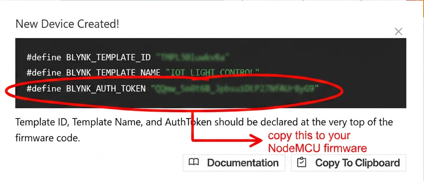
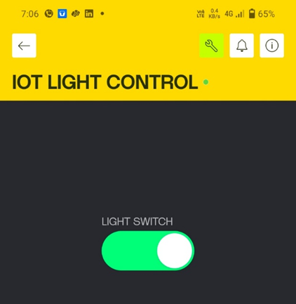
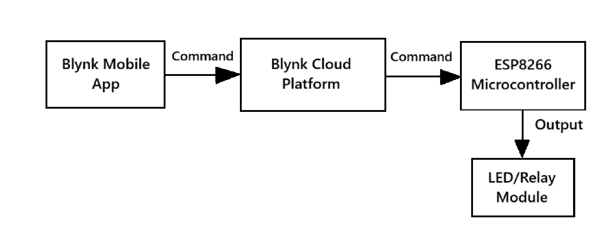
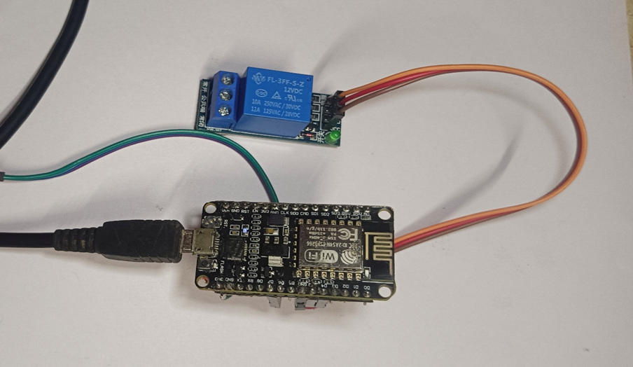
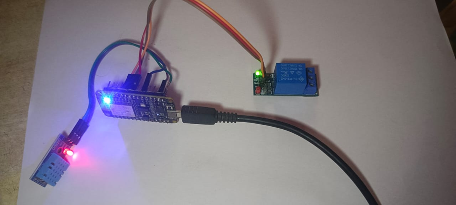

Minor Project | GlowLogics Solutions Pvt. Ltd. Internship 2025-26
A dual-module IoT implementation using the ESP8266 NodeMCU to perform real-time environmental sensing via ThingSpeak and secure remote device actuation through the Blynk IoT platform.

Overview
A remote device control system that allows a user to switch an electrical load ON and OFF wirelessly from anywhere using the Blynk mobile application. The ESP8266 NodeMCU receives commands from the Blynk cloud and controls a relay module or LED accordingly.

How It Works
User presses ON/OFF button on Blynk mobile app
Command is sent over internet to Blynk cloud platform
Blynk cloud identifies the device using Auth Token
Command is forwarded to ESP8266 NodeMCU
NodeMCU changes GPIO pin state to control relay or LED
Relay switches the connected appliance ON or OFF
Hardware Required
ESP8266 NodeMCU microcontroller board
5V Relay module OR 3V LED (for demonstration)
Breadboard and jumper wires
USB micro cable for programming and power
Smartphone (Android or iOS)
Wiring
Component	NodeMCU Pin
Relay IN	D4 (GPIO2)
Relay VCC	5V (VIN)
Relay GND	GND
Software Required
Arduino IDE
ESP8266 board core installed in Arduino IDE
Blynk library for ESP8266
Blynk mobile app (Android / iOS)
Cloud Platform
Blynk IoT — https://blynk.io
Virtual Pin V0 → Controls relay ON/OFF
Setup Instructions
Install Blynk app on your smartphone
Create a new template in Blynk Cloud Console
Add a Button widget linked to Virtual Pin V0
Copy your Auth Token and Template ID from Blynk Console
Blynk Cloud Configuration

Figure 1: Blynk Cloud Console showing device configuration and Auth Token.

Figure 2: User Interface (UI) design on Blynk Mobile Application.

Open IOT_LIGHT_CONTROL_BLYNK.ino
Replace the following with your own credentials:
YOUR_TEMPLATE_ID → your Blynk Template ID
YOUR_BLYNK_AUTH_TOKEN → your Blynk Auth Token
YOUR_WIFI_SSID → your WiFi network name
YOUR_WIFI_PASSWORD → your WiFi password
Select board: NodeMCU 1.0 (ESP-12E Module)
Upload the code
Open Blynk app and press the button to control device
Sytem Block Diagram representation
IoT Remote Control Block Diagram
Figure 3: Block diagram of the IoT-based Remote Device Control System illustrating communication between the Blynk App and the Relay module.

System setup snapshot

          Figure 4: Prototype hardware setup featuring ESP8266 and 5V Relay Module.
Expected Output

       Figure 5: Relay module in ON state indicating successful actuation via Blynk application
